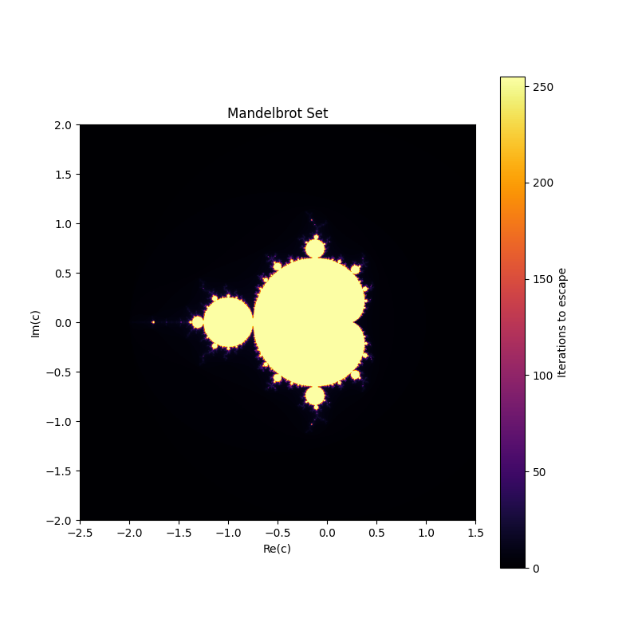

# Mandelbrot Set Visualization

## What is the Mandelbrot Set?

The Mandelbrot set is a famous fractal named after mathematician Benoit Mandelbrot. It is defined as the set of complex numbers `c` for which the function `f(z) = z^2 + c` does not diverge when iterated starting from `z = 0`. 

In simpler terms, for each complex number `c`, we repeatedly apply the function and check if the value of `z` escapes to infinity or remains bounded. Points that remain bounded after a large number of iterations belong to the Mandelbrot set, while points that escape are considered outside of it.

The Mandelbrot set exhibits beautiful fractal patterns, meaning that as you zoom in on its boundary, you will discover intricate and self-similar structures appearing infinitely.

## About the Code

This Python script generates a visualization of the Mandelbrot set using the `numpy` and `matplotlib` libraries. Here are the key features of the code:

1. **Grid Generation**: It creates a 2D grid of complex numbers (`C`) that represent points in the complex plane. Each pixel in the image corresponds to a complex number.

2. **Iteration**: For each point `C`, the script iterates the function `Z = Z^2 + C` a maximum number of times (set to `256` iterations by default). The value of `Z` is checked to see if it escapes, defined as having a magnitude greater than `2`.

3. **Escape Times**: The number of iterations before escape (or if the point never escapes) is stored in the `mandelbrot_set` array. This array represents the final image, where points in the Mandelbrot set are colored based on how long it takes them to escape.

4. **Plotting**: The result is visualized using `matplotlib`, where a colormap (`inferno`) is applied to show the escape times in different colors.

### Cross-Platform Compatibility

The code is designed to work on all operating systems (Linux, Windows, macOS). It saves the output by default as an image file, but it can also display the plot interactively if the appropriate environment is available.

### How to Run the Code

1. **Install Required Libraries**:
   Ensure you have the required libraries installed. You can do this by running:
   ```bash
   pip install numpy matplotlib
   ```

2. **Run the Script**:
   - To save the plot as an image:
     ```bash
     python3 mandelbrot.py
     ```
   - To display the plot interactively (if supported by your environment):
     ```bash
     python3 mandelbrot.py --show
     ```

3. **Output**:
   - The output will be saved as `mandelbrot_set.png` in the same directory if you run it without the `--show` flag.
   - If you use the `--show` flag and your environment supports it, a window will pop up displaying the Mandelbrot set.

### Customization

You can customize the following parameters in the code:
- **Resolution**: Change the `width` and `height` variables to modify the resolution of the output image.
- **Zoom**: Adjust the `x_min`, `x_max`, `y_min`, and `y_max` variables to zoom in or out on different regions of the complex plane.
- **Iterations**: Modify the `max_iter` variable to control the maximum number of iterations for escape checking.

## Example Output

The output of the script will look something like this:



Enjoy exploring the infinite beauty of the Mandelbrot set!
